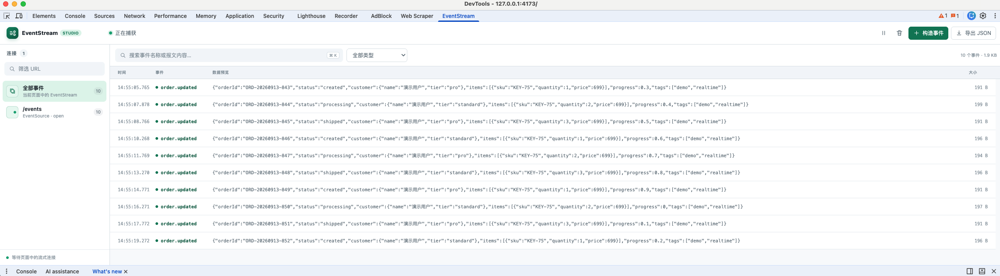
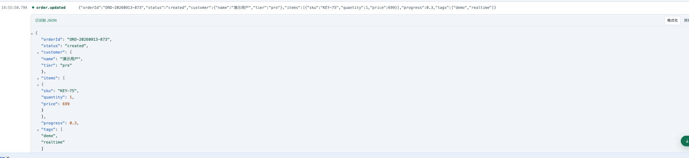
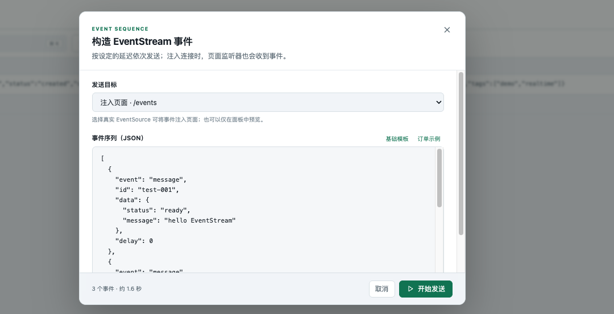

# EventStream Studio

一个专门查看与调试 Server-Sent Events（SSE / `text/event-stream`）的 Chrome DevTools 扩展。它将原始 `data:` 报文识别为 JSON，提供折叠格式化视图，并按连接组织事件。

## 界面预览

### 实时事件列表



### JSON 格式化视图



### EventStream 事件构造器



## 功能

- 捕获原生 `EventSource`、返回 `text/event-stream` 的 `fetch()` 和 XHR 请求
- JSON 自动识别、语法着色、层级折叠，以及格式化/原文切换
- 按连接筛选，搜索事件名称和报文内容，按事件类型过滤
- 展示事件时间、字节大小、连接状态与传输方式
- 暂停界面更新、复制单条报文、导出当前筛选结果为 JSON
- 新事件增量刷新并自动跟随列表底部；手动查看历史时保留位置并提示未读事件数
- 内置事件构造器，可编排一系列测试事件并按延迟顺序发送
- 可仅在面板中预览模拟流，也可注入真实 `EventSource`，让页面业务监听器收到测试事件
- 自动适配 Chrome DevTools 明暗主题

## 安装

1. 打开 `chrome://extensions`。
2. 开启右上角的“开发者模式”。
3. 点击“加载已解压的扩展程序”，选择本项目目录。
4. 打开目标页面的 DevTools，选择 **EventStream** 面板。
5. 刷新目标页面或重新触发 SSE 请求。

> 扩展在页面脚本执行前注入捕获器。首次安装或更新扩展后，已经打开的页面必须刷新一次。

## 本地演示

```bash
npm run demo
```

访问 `http://127.0.0.1:4173`，打开 EventStream 面板后刷新页面。演示服务每 1.5 秒发送一条名为 `order.updated` 的 JSON 事件。

## 构造测试事件

点击面板右上角的 **构造事件**：

1. 选择“仅在面板中预览”，或选择一个当前页面内已捕获的 `EventSource`。
2. 使用 JSON 数组定义事件序列。`event`、`id` 和 `delay` 可选，`data` 必填。
3. 点击“开始发送”。当目标是真实连接时，页面原有的事件监听器会像收到服务端事件一样被调用。

```json
[
  {
    "event": "order.updated",
    "id": "test-001",
    "data": { "orderId": "ORD-TEST-001", "status": "processing" },
    "delay": 0
  },
  {
    "event": "order.updated",
    "id": "test-002",
    "data": { "orderId": "ORD-TEST-001", "status": "shipped" },
    "delay": 1000
  }
]
```

`delay` 表示发送该事件前等待的毫秒数，单次最多 100 个事件。注入只影响当前页面内的 JavaScript 事件分发，不会向后端发送数据。

## 测试

```bash
npm test
```
